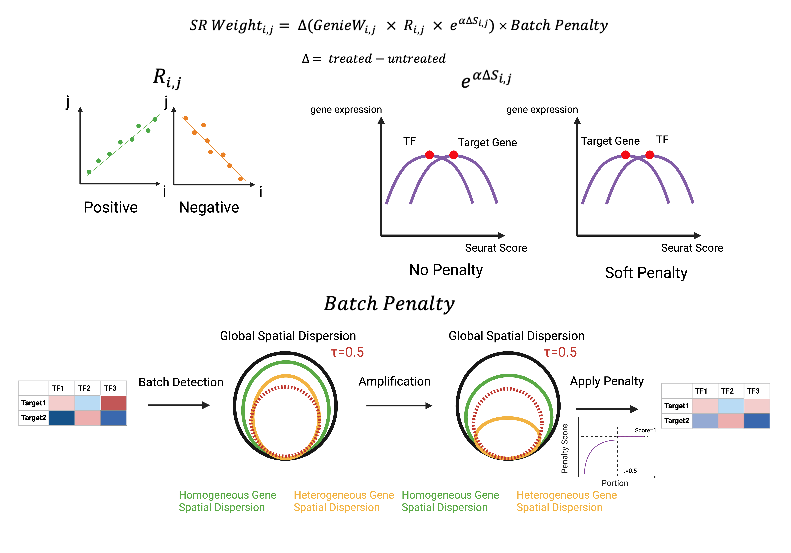

# BARNO
Author E-mail: zhang.xi6@northeastern.edu

**B**atch-**A**ware **R**egulatory **N**etwork **O**ptimization

BARNO is an R package for batch-aware optimization of transcription factor regulatory weights in single-cell transcriptomic analysis. The framework is designed to reduce sample-group-specific or batch-driven transcription factor signals while preserving biologically coherent regulatory structure.

<p align="center">

</p>

<p align="center">

</p>

## Overview

BARNO builds on GENIE3-based regulatory network inference and refines transcription factor–target gene weights by integrating:

- regulatory importance from GENIE3
- transcription factor–target gene correlation
- temporal consistency inferred from transcriptional scoring
- batch-aware penalization based on spatial dispersion in PCA space

Using this framework, BARNO supports:

- construction of regulatory weight matrices
- batch-aware regulator prioritization
- survival-associated module selection
- core regulator identification
- layered gene regulatory network (GRN) reconstruction

## Repository structure
```text
BARNO/
├── R/            # Core package functions
├── Run/          # Example analysis scripts
├── man/          # Function documentation
├── figures/      # Figures used in the manuscript / README
├── data/         # Data notes and small example files
├── DESCRIPTION
├── NAMESPACE
└── README.md
```

## Installation
You can install BARNO from GitHub using devtools:
```text
install.packages("devtools")
devtools::install_github("xxxxxi0001/BARNO")
```
Then load the package:
```text
library(BARNO)
```

## Data Availability
The full datasets used in this study are too large to be distributed directly in this repository.

Original melanoma single-cell RNA-seq data analyzed in this study are available from the Broad Institute Single Cell Portal under accession SCP109:
https://singlecell.broadinstitute.org/single_cell/study/SCP109/melanoma-immunotherapy-resistance

Users should download the original dataset separately and provide the local file path when running the BARNO pipeline.

## Example Workflow
1. Load Weight
```text
set.seed(123)
melanocytic_genes <- c("TYR", "DCT", "MLANA", "PMEL", "MITF", "SOX10", "MIA", "GPNMB", "S100B", "ERBB3")
weight_matrix_melanocytic<-TR_weight("Mel.malignant.rds",melanocytic_genes,genie_file = "genie_matrix.rds")
```
2. Load TF
```text
Melanocytic_TRW<-readRDS("TR_Weight_Melanocytic_punished.rds")
top_genes_Melanocytic<-top_TRweight_genes(Melanocytic_TRW)
saveRDS(top_genes_Melanocytic,file="Top_TF_of_Melanocytic_punished.rds")
top_tf_Melanocytic<-readRDS("Top_TF_of_Melanocytic_punished.rds")
```
3. Print out TF
```text
head(top_tf_Melanocytic$top_positive_genes,20)
head(top_tf_Melanocytic$top_negative_genes,20)
head(top_tf_Melanocytic$top_positive_summary,20)
head(top_tf_Melanocytic$top_negative_summary,20)
```
4. Cox Regression Construction & Choose Important TF
5. Run KM
```text
weight_matrix_melanocytic<-readRDS("TR_Weight_Melanocytic.rds")
df_cof_melanocytic_STAT1<-select_co_factor(weight_matrix_melanocytic,"STAT1")
signature_genes<-head(df_cof_melanocytic_STAT1$Gene,10)
melanocytic_STAT1_fit<-km_curve(signature_genes,"TCGA_SKCM.rds","STAT1")
```
6. Run GRN
```text
weight_matrix_melanocytic<-readRDS("TR_Weight_Melanocytic.rds")
mst_melanocytic_STAT1<-layered_graph("STAT1",weight_matrix_melanocytic)
directed_mst_visualization(mst_melanocytic_STAT1,"STAT1",aspect_ratio = 0.5,text_size=0.6,text_centrality=0,arrow_size=1)
```
